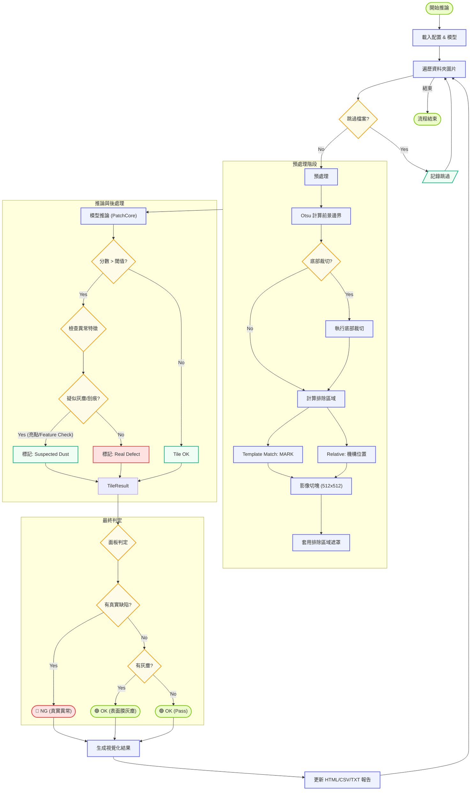

# CAPI 面板檢測邏輯流程圖

此流程圖展示了 CAPI 系統從讀取圖片到判定 OK/NG 的完整檢測邏輯。包含最新的「表面膜灰塵/刮痕過濾」機制。

## 邏輯說明

1. **檔案過濾**：檢查檔名是否在配置的 `skip_files` 清單中。
2. **預處理**：
   - 使用 Otsu 二值化自動裁切前景。
   - 根據設定執行底部裁切 (Bottom Crop)。
   - 識別排除區域 (MARK 二維碼, 機構位置)。
   - 將影像切分為 512x512 的 tiles (stride 512, 非重疊)。
   - 對重疊排除區域的 tiles 建立遮罩 (Mask)。
3. **推論**：
   - PatchCore 模型計算每個 tile 的異常分數和熱圖。
   - 若有遮罩，排除區域內的異常分數會被忽略。
4. **異常特徵檢查**：
   - 若分數超過閾值，檢查是否為「疑似灰塵/刮痕」(高亮度點特徵)。
   - 若檢查通過，標記為 `Suspected Dust`。
5. **面板最終判定**：
   - **🔴 NG**：只要有任何一個 tile 是真實缺陷 (Real Defect)。
   - **🟢 OK (表面膜)**：所有異常 tiles 都是 `Suspected Dust` (視為表面膜問題，忽略)。
   - **🟢 OK**：沒有任何異常 tiles。
