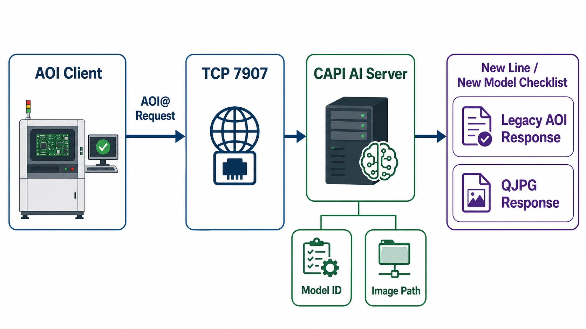

# CAPI 客戶端通訊協議規格

日期: 2026-09-02

範圍: AOI / Testing 客戶端與 CAPI AI 推論伺服器之間的 TCP Socket 通訊。本文以目前 repo 實作為準，主要來源為 `capi_server.py`、`server_config.yaml`、`tests/test_qjpg_report_response.py`。

會議用流程圖:



## 1. 先講結論

- 客戶端以 TCP Socket 連到 CAPI Server。Production 設定目前是 `0.0.0.0:7907`。
- 客戶端送出的請求仍是 `AOI@...` 格式。
- Server 目前回覆兩種協議，放在同一包 response 內:
  1. 第一行: 舊協議 `AOI@...`
  2. 第二行: 新協議 `@QJPG-...`
- 回覆內容最後會再補 `\r\n`。也就是線上封包概念為:

```text
AOI@玻璃ID;機種ID;機台編號;機檢判定;AI判定\r\n
@QJPG-玻璃ID;MARK判定;MARK字;Defect判定+Defect清單,\r\n
```

重要確認點: 如果新客戶端只讀第一行，它目前會讀到舊 `AOI@` 回覆，不會讀到 `@QJPG`。若客戶要求 `@QJPG` 必須在第一行，程式需要調整 `build_dual_protocol_response()` 的順序。

## 2. 目前假設

- 客戶端仍使用 TCP Socket，不是 HTTP / REST。
- 客戶端請求 prefix 仍為 `AOI@`。
- 新線體或新機種預設不改協議格式，先透過模型設定、路徑映射、defect code、影像命名規則導入。
- 客戶端可接受 response 內含兩行資料，或至少能忽略自己不使用的那一行。

如果以上任一點不成立，後續就不是單純新增機種設定，會變成協議相容性修改。

## 3. 傳輸層規格

| 項目              | 現況                                                          |
| --------------- | ----------------------------------------------------------- |
| Protocol        | TCP Socket                                                  |
| Production port | `7907`，由 `server_config.yaml.server.port` 控制                |
| Listen host     | `0.0.0.0`，由 `server_config.yaml.server.host` 控制             |
| 連線模式            | 支援長連線，production `recv_timeout: 0` 表示不因閒置超時自動關閉             |
| 同時連線數           | `max_connections: 10`                                       |
| 接收 buffer       | `recv_buffer_size: 4096` bytes                              |
| 編碼              | 目前以 UTF-8 decode，錯誤字元忽略                                     |
| 請求結尾            | 建議客戶端送 `\r\n`；Server 也能處理 `\n`、`\r`、`\0`，或欄位數已足夠的 `AOI@` 請求 |
| 回覆結尾            | Server sendall 時補 `\r\n`                                    |

Server 對黏包有基本保護: 如果同一段資料內出現多個 `AOI@`，會切成多筆請求，先處理第一筆，剩下放入 buffer。這是相容保護，不建議客戶端依賴黏包送法。

## 4. Request 格式

### 4.1 無炸彈資料

```text
AOI@玻璃ID;機種ID;機台編號;解析度X,解析度Y;機檢判定;圖片目錄路徑
```

範例:

```text
AOI@T863BF29AH44;GN156HCAB6G0S;CAPI1403;2000,1000;OK;\\192.168.2.101\d\TIANMU\yuantu\GN156HCAB6G0S\20260708\T863BF29AH44
```

### 4.2 有炸彈資料

```text
AOI@玻璃ID;機種ID;機台編號;解析度X,解析度Y;機檢判定;圖片前綴;(座標);圖片目錄路徑
```

點型座標:

```text
AOI@G1;M1;CAPI1403;2000,1000;OK;W0F00000;(350/174;1465/363);\\192.168.2.101\d\panel\G1
```

線型座標:

```text
AOI@G1;M1;CAPI1403;2000,1000;OK;W0F00000;(350/174/1465/363);\\192.168.2.101\d\panel\G1
```

### 4.3 AAPI AOI NG 座標

AAPI 的機檢判定為 `NG` 時，Testing 必須在圖片目錄後用分號加上 AOI 座標串：

```text
AOI@...;圖片目錄路徑;圖片前綴,缺陷代碼(X,Y)圖片前綴,缺陷代碼(X,Y)...
```

範例：

```text
AOI@YQ52J5019D21;GN140BGAAN80S;AAPI09-12;1366,768;NG;W0F00000;(90/90;115/115;140/140;90/140;140/90);/192.168.2.190/d/image/20260814/YQ23CQ220B12;W0F00000,CDK2(01092,00131)W0F00000,CDK2(00858,00553)W0F00000,CM00(02996,00555)W0F00000,CM00(05315,00716)
```

- AOI 機檢為 `OK` 時，圖片目錄後不得加上這段字串。
- X 座標仍沿用 AAPI 原轉換規則（例如 `01092` 轉為 `364`），Y 座標保持不變。
- Server 直接使用請求尾段的座標，不再讀取 AAPI `/d/LOG/Report*.log`。

### 4.4 Request 欄位說明

| 欄位          | 範例                            | 用途                                                                 |
| ----------- | ----------------------------- | ------------------------------------------------------------------ |
| `玻璃ID`      | `T863BF29AH44`                | 該片 panel 的追溯 ID，也會放入回覆                                             |
| `機種ID`      | `GN156HCAB6G0S`               | 模型 dispatch 的主要 key；需對應 `machine_config.yaml.machine_id` 或模型自動切換規則 |
| `機台編號`      | `CAPI1403`                    | 記錄、dashboard 顯示、DB 追溯用                                             |
| `解析度X,解析度Y` | `2000,1000`                   | 產品座標系大小；QJPG defect 座標會轉到這個解析度                                     |
| `機檢判定`      | `OK` / `NG` / `HY`            | `HY` 會跳過 AI 推論並走畫異回覆；其他值目前不硬擋，但規格上不要送非約定值                          |
| `圖片前綴`      | `W0F00000`                    | 有炸彈資料時使用，代表座標所屬畫面                                                  |
| `座標`        | `(x/y;x/y)` 或 `(x1/y1/x2/y2)` | 炸彈點或線座標                                                            |
| `圖片目錄路徑`    | `\\192.168.2.101\d\...`       | Server 端會依 `path_mapping` 轉成實際 Linux 掛載路徑讀圖                        |
| `AAPI AOI 座標串` | `W0F00000,CDK2(01092,00131)` | 僅 AAPI NG 附加在圖片目錄後，可連續放置多筆紀錄                                |

注意: 圖片路徑可能包含分號時，Server 會重新 join 路徑欄位，並以 AOI 座標記錄格式辨識 AAPI 尾段。客戶端規格仍建議避免在路徑中使用 `;`。

## 5. Server 處理流程

1. 收到 TCP bytes，去除 `\r`、`\n`、`\0`。
2. 以 `AOI@` 判斷 request 起點，解析欄位。
3. 依 `機種ID` 找到對應 model config；找不到時使用 active / fallback config。
4. 依 `path_mapping` 把 Windows UNC 路徑轉成 server 可讀的路徑。
5. AAPI NG 直接解析 Testing request 尾段的 AOI 座標。
6. 若 `機檢判定 == HY`，跳過 AI 推論，直接回覆畫異 defect。
7. 其他情境執行 AI 推論，產出 `OK` / `NG` / `OK-i` / `ERR:*`。
8. 先回覆客戶端，再非同步寫入 DB、heatmap、推論 log。

## 6. Response 格式

### 6.1 舊協議 AOI response

```text
AOI@玻璃ID;機種ID;機台編號;機檢判定;AI判定
```

範例:

```text
AOI@T863BF29AH44;GN156HCAB6G0S;CAPI1403;OK;NG
```

欄位:

| 欄位     | 說明                                           |
| ------ | -------------------------------------------- |
| `玻璃ID` | 原 request 的 glass id                         |
| `機種ID` | 原 request 的 model id                         |
| `機台編號` | 原 request 的 machine no                       |
| `機檢判定` | 原 request 的 machine judgment                 |
| `AI判定` | `OK` / `NG` / `ERR:*`；內部 `OK-i` 在舊協議會轉成 `OK` |

### 6.2 新協議 QJPG response

```text
@QJPG-玻璃ID;MARK判定;MARK字;Defect判定+Defect清單,
```

範例:

```text
@QJPG-T863BF29AH44;OK;EJ;NGPCDK20100000500W0F00000,
```

欄位:

| 欄位                  | 說明                                        |
| ------------------- | ----------------------------------------- |
| `玻璃ID`              | 原 request 的 glass id                      |
| `MARK判定`            | 有抓到 MARK 字就 `OK`，沒抓到就 `NG`                |
| `MARK字`             | 實際抓到的 MARK，例如 `EJ`；沒抓到時為 `00`             |
| `Defect判定+Defect清單` | `OK`、`NG`、`NG + defect records`、或 `ERR:*` |
| 結尾逗號                | QJPG response 固定以 `,` 結尾                  |

### 6.3 QJPG defect record 組碼

每個 defect record 格式:

```text
{defect_code}{product_x_5}{product_y_5}{image_prefix}
```

說明:

| 片段             | 範例         | 說明                              |
| -------------- | ---------- | ------------------------------- |
| `defect_code`  | `PCDK2`    | 由 model config 的 report code 決定 |
| `product_x_5`  | `01000`    | 產品座標 X，5 碼，不足補 0                |
| `product_y_5`  | `00500`    | 產品座標 Y，5 碼，不足補 0                |
| `image_prefix` | `W0F00000` | 影像前綴，通常來自檔名去掉時間戳                |

完整範例拆解:

```text
NGPCDK20100000500W0F00000
```

| 片段         | 意義                          |
| ---------- | --------------------------- |
| `NG`       | 本次 QJPG defect field 判定為 NG |
| `PCDK2`    | 黑點 / 一般點 defect code        |
| `01000`    | X = 1000                    |
| `00500`    | Y = 500                     |
| `W0F00000` | 白光畫面                        |

目前預設 defect code:

| 類型           | 預設 code | 設定欄位                                |
| ------------ | ------- | ----------------------------------- |
| 黑點 / 一般點     | `PCDK2` | `report_black_dot_defect_code`      |
| 白點 / B0F 類亮點 | `PTMD6` | `report_white_dot_defect_code`      |
| 未知點          | `PCDK2` | `report_unknown_dot_defect_code`    |
| 炸彈           | `PCDK3` | `report_bomb_defect_code`           |
| 畫異 HY        | `PCO05` | `report_image_abnormal_defect_code` |

座標來源:

- Two-stage 有辨識出 REAL_NG 特徵時，逐筆使用每個 REAL_NG 在原圖上的實際特徵中心；同一 Tile 可輸出多筆 record。
- AOI 座標置中的 Tile 會優先使用最接近 AOI 中心的有效 REAL_NG heatmap 區域；中央沒有有效區域時，沿用 AOI Report 的原始產品座標。
- 一般 Grid Tile 使用 heatmap peak 座標。
- 若沒有 peak，使用 tile center。
- 座標會從影像座標依 panel bounds 轉換到 request 傳入的產品解析度。
- 最後輸出時 clamp 到 `0..99999`，並格式化成 5 碼。

## 7. AI 判定對 response 的影響

| 內部 AI 判定                   | 舊 AOI response             | QJPG response                                       |
| -------------------------- | -------------------------- | --------------------------------------------------- |
| `OK`                       | `OK`                       | 通常 `OK`；若仍有可回報的炸彈 record，QJPG 會回 `NG + bomb record` |
| `OK-i`                     | `OK`                       | 規格內點不回報 defect，通常 `OK`；若有炸彈 record 仍會回報             |
| `NG`                       | `NG`                       | `NG` 或 `NG + defect records`                        |
| `ERR:HY`                   | `ERR:HY`                   | `NG + 畫異 defect record`                             |
| `ERR:PROTOCOL_ERROR (...)` | `ERR:PROTOCOL_ERROR (...)` | `ERR:PROTOCOL_ERROR (...)`                          |
| `ERR:INTERNAL_ERROR (...)` | `ERR:INTERNAL_ERROR (...)` | `ERR:INTERNAL_ERROR (...)`                          |

Protocol error 如果 request 完全無法解析，舊協議會保留錯誤形狀:

```text
AOI@;;;;ERR:PROTOCOL_ERROR (bad)
@QJPG-;NG;00;ERR:PROTOCOL_ERROR (bad),
```

## 8. 新線體 / 新機種導入時可能要做的事

重點判斷: 先不要預設要改協議。多數導入工作是設定與資料流對齊。

| 類別          | 要確認的事                                                                      | 可能動作                                                            |
| ----------- | -------------------------------------------------------------------------- | --------------------------------------------------------------- |
| 網路          | AOI client 要連哪台 server、哪個 port、是否有防火牆                                      | 保持 `7907` 或調整 `server_config.yaml.server.port`                  |
| 回覆讀法        | 客戶端讀第一行、第二行，還是整包讀完再 parse                                                  | 若新客戶端要求 QJPG 第一行，需改 `build_dual_protocol_response()`            |
| `機種ID`      | 客戶端送出的 `ModelID` 是否等於 server 的 `machine_id`                                | 新增 / 啟用對應 model bundle，或調整自動模型切換規則                              |
| `機台編號`      | 新線體的 machine no 命名                                                         | 通常不用改程式，會進 DB 與 dashboard                                       |
| 影像路徑        | 新線體送出的 UNC prefix、server 掛載點、權限                                            | 更新 `server_config.yaml.path_mapping`，確認 Linux 讀得到圖              |
| 影像命名        | 是否仍有 `STANDARD`、`W0F00000`、`G0F00000`、`R0F00000`、`B0F00000`、`WGF50500` 等前綴 | 若新增畫面前綴，要補模型 mapping、threshold、skip/side shot/report 規則         |
| 產品解析度       | request 的 `解析度X,解析度Y` 是否為客戶 defect 座標系                                     | 用樣本圖 spot-check QJPG 座標是否落在客戶系統正確位置                             |
| Defect code | 客戶要的黑點、白點、炸彈、HY code 是否相同                                                  | 更新 model config 的 `report_*_defect_code`                        |
| MARK        | 新機種 MARK 位置、大小、字樣是否不同                                                      | 更新 `mark_template_path`、`mark_fallback_position`、MARK threshold |
| 模型與閾值       | 新機種是否已有 OK/NG/overkill/miss 樣本                                             | 訓練新 bundle，設定 `threshold_mapping`、inner/edge model              |
| 不檢測區        | 新機種機構區、MARK 區、邊緣遮罩是否不同                                                     | 更新 exclusion zones、panel polygon、edge/inner 設定                  |
| HY 畫異       | 客戶是否接受 HY 回 `ERR:HY` + QJPG PCO05                                          | 若客戶端只接受 `NG`，需討論相容策略                                            |
| 炸彈座標        | 新線體是否會送炸彈點/線，座標系是否一致                                                       | 做炸彈樣本 dry run，確認 record code 與座標                                |
| 併發量         | 新線體數量、每片推論時間、是否多機台同時送                                                      | 評估 `max_connections`、GPU 排程、是否需要分流                              |

## 9. 建議下午跟客戶確認的問題

1. 新客戶端是否會讀 `@QJPG`？若會，是讀第一行還是掃描整包 response？
2. Response line order 要求是 `AOI@` 先，還是 `@QJPG` 先？
3. Request 是否固定以 `\r\n` 結尾？是否可能多筆 request 黏在同一包送？
4. `ModelID`、`MachineNo` 的實際範例各是什麼？
5. 新線體圖片路徑的 UNC prefix 是什麼？server 端掛載路徑與權限是否已準備？
6. 新機種有哪些影像前綴？是否有新增光源、側拍圖、或 skip 圖？
7. QJPG defect code 字典是否沿用目前 `PCDK2` / `PTMD6` / `PCDK3` / `PCO05`？
8. 客戶端是否能接受 `OK-i` 在舊協議顯示為 `OK`？
9. HY 畫異要被視為 `ERR`、`NG`，還是獨立分類？
10. 客戶端座標系以產品解析度為準，還是原圖 pixel 為準？

## 10. 建議驗證流程

### A. 紙面規格確認

- 確認 request 欄位順序。
- 確認 response 兩行順序。
- 確認 defect code 字典。
- 確認座標系與解析度。

### B. Socket dry run

使用測試 client 對 staging server 送 4 種 request:

1. OK 無 defect。
2. NG 有 defect。
3. HY 畫異。
4. 錯誤格式 request。

每筆都保存原始 request / raw response bytes，確認 CRLF 與兩行內容。

### C. 新機種樣本驗證

- 取新機種 OK 樣本，確認不過殺。
- 取新機種 NG 樣本，確認 QJPG defect code 與座標。
- 取 MARK 樣本，確認 `MARK判定` 與 `MARK字`。
- 若有炸彈資料，確認炸彈 record 不被過濾掉。

### D. 上線前設定檢查

- `server_config.yaml.path_mapping` 已包含新線體 UNC prefix。
- `server_config.yaml.model_configs` 已包含新機種 bundle。
- 新 bundle 的 `machine_config.yaml.machine_id` 與客戶端 `ModelID` 對得上。
- defect code、threshold、skip_files、side_shot_prefixes、MARK 設定已確認。
- dashboard 能看到新 machine no 的連線與推論紀錄。

## 11. 目前最需要決策的點

最需要先問客戶的是 response line order。

目前程式是:

```text
AOI@... first
@QJPG-... second
```

這對舊客戶端最安全，因為舊 client 讀第一行就能維持原行為。但如果新客戶端是「只讀第一行且期待 QJPG」，就必須改成 QJPG first，或請客戶端改成讀第二行 / 掃描 `@QJPG-` prefix。

建議下午說法:

```text
目前 Server 為了相容舊 client，會同時送舊 AOI 與新 QJPG。
現行順序是 AOI 第一行、QJPG 第二行。
新線體若要接 QJPG，請確認 client 是讀第二行或依 prefix 掃描；如果只能讀第一行，我們需要調整 Server 回覆順序。
```
