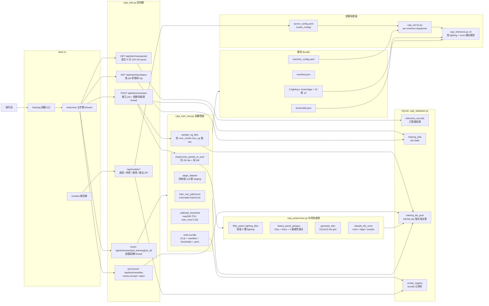

# 新機種 PatchCore 模型訓練系統架構說明

本文整理 2026-04-28 新增的「新機種 PatchCore 訓練 Wizard」功能。重點是讓操作員從 Web 介面選取 AOI 判 OK 的 panel，經過共用前處理、tile review、PatchCore 訓練、threshold 校準後，產出可部署的模型 bundle。

## 系統架構圖



## 功能流程

1. **Step 1 選 panel**：`/api/train/new/panels` 從 `inference_records` 找指定 `model_id` 且 `machine_judgment='OK'` 的 panel，Wizard 要求選滿 5 片。
2. **Step 2 前處理**：`/api/train/new/start` 建立 `training_jobs`，背景 thread 呼叫 `preprocess_panels_to_pool()`。每片 panel 會過濾出 `G0F00000`、`R0F00000`、`W0F00000`、`WGF50500`、`STANDARD` 五種 lighting，切成 OK tile 與縮圖後寫入 `training_tile_pool`。
3. **NG 樣本補充**：`sample_ng_tiles()` 從 `over_review/*/true_ng/{lighting}/crop/` 每種 lighting 抽 NG tile，作為 threshold 校準與驗證用。
4. **Step 3 tile review**：操作員可將不適合訓練的 tile 設成 `reject`；訓練只吃 `decision='accept'` 的 tile。
5. **Step 4 訓練**：`run_training_pipeline()` 依 5 種 lighting 與 `inner/edge` 兩區建立 10 個訓練 unit。每個 unit 個別 staging、訓練 PatchCore、推論 OK/NG 樣本校準 threshold。
6. **Step 5 完成**：輸出 bundle，內容包含 10 個 `.pt`、`manifest.json`、`thresholds.json`、`machine_config.yaml`，並註冊到 `model_registry`。
7. **模型庫管理**：`/models` 可檢視、啟用、停用、刪除、匯出 ZIP。啟用會把 bundle 內的 `machine_config.yaml` 加到 `server_config.yaml.model_configs`，重啟 server 後生效。

## 模組職責

| 模組 | 職責 |
|---|---|
| `templates/train_new/*.html` | 五步驟 Wizard UI：選 panel、看前處理進度、review tile、看訓練進度、完成摘要 |
| `capi_web.py` | HTTP route 與背景 thread orchestration；負責 job 狀態、API、log、模型庫操作入口 |
| `capi_database.py` | 新增 `training_jobs`、`training_tile_pool`、`model_registry` 三組 CRUD |
| `capi_preprocess.py` | 訓練與推論共用的 panel polygon 偵測、tile 切分、inner/edge 分區 |
| `capi_train_new.py` | PatchCore 訓練核心：OK/NG tile 準備、10 unit 訓練、threshold 校準、bundle 輸出 |
| `capi_model_registry.py` | bundle 列表、啟用、停用、刪除、ZIP 匯出；啟用時修改 `server_config.yaml.model_configs` |
| `capi_config.py` | 支援新架構 YAML：`model_mapping` 與 `threshold_mapping` 可為 `{lighting: {inner, edge}}` |
| `capi_server.py` | 啟動時載入多個機種 config，依 request 的 `model_id` 建立或快取對應 inferencer |
| `capi_inference.py` | 新架構 `_process_panel_v2` 重新使用 `capi_preprocess`，依 tile 的 lighting + zone 選模型與 threshold |

## 核心原理

### 1. C-10 模型架構

新功能不是一個機種只訓練 1 個 PatchCore，也不是沿用舊版 5 lighting 模型，而是：

```text
5 種 lighting x 2 種區域(inner / edge) = 10 個 PatchCore 模型
```

這樣做的原因是 inner 與 edge 的正常紋理分布不同。edge tile 常有邊界、光影、易斯貼或幾何裁切差異，若與 inner tile 混在同一個模型，PatchCore 的 normal memory bank 會變得太寬，容易降低 specificity。拆成 inner/edge 後，每個模型只學自己區域的正常特徵。

### 2. 共用前處理避免 train/infer drift

`capi_preprocess.py` 同時被訓練與推論使用：

- 用 Otsu 找 panel 前景與 bbox。
- 對二值 mask 的上下左右邊做線性擬合，產生四角 polygon。
- 在 bbox 內以 512x512、stride 512 切 tile。
- coverage 太低的 tile 丟掉。
- 完全在 polygon 內且中心距離邊界大於 `edge_threshold_px=768` 的 tile 歸為 inner，其餘有效 tile 歸為 edge。

這讓訓練時看到的 tile 與推論時送進模型的 tile 規則一致，避免先前訓練端與推論端 bbox、mask、MARK 排除邏輯不同造成的 drift。

### 3. PatchCore 訓練與判異常

PatchCore 主要用 OK 樣本建立正常特徵記憶庫：

- 使用預訓練 backbone，目前是 `wide_resnet50_2`，抽取影像 patch feature。
- 以 coreset sampling 壓縮 normal feature memory bank。
- 推論時，tile 的 patch feature 若離最近的 normal feature 太遠，代表不像訓練時的正常樣本，分數升高。
- 每個 unit 會用 OK tile 的最高分與 NG tile 分布校準 threshold：`max(NG P10, train_max * 1.05)`。

### 4. Bundle 與部署模式

訓練完成後 bundle 會長成：

```text
model/<machine_id>-<timestamp>-<job_id>/
  G0F00000-inner.pt
  G0F00000-edge.pt
  R0F00000-inner.pt
  R0F00000-edge.pt
  W0F00000-inner.pt
  W0F00000-edge.pt
  WGF50500-inner.pt
  WGF50500-edge.pt
  STANDARD-inner.pt
  STANDARD-edge.pt
  manifest.json
  thresholds.json
  machine_config.yaml
```

`machine_config.yaml` 是推論端真正讀取的機種設定，裡面包含 `model_mapping` 與 `threshold_mapping`。模型庫啟用 bundle 時，不會熱部署，而是把該 YAML 路徑加入 `server_config.yaml.model_configs`，需要重啟 server 才會載入。

## 推論端如何使用新模型

1. `capi_server.py` 啟動時讀 `server_config.yaml.model_configs`，建立 `configs_by_machine`。
2. 收到推論 request 時，依 `model_id` 找對應機種 config。
3. 若 config 的 `model_mapping` 是 `{lighting: {inner, edge}}`，`capi_config.py` 會標成 `is_new_architecture=True`。
4. `capi_inference.py` 走 `_process_panel_v2()`，再次用 `capi_preprocess.preprocess_panel_folder()` 切 tile。
5. 每張 tile 依 `lighting + zone` 呼叫對應 `.pt`，並套用對應 threshold。
6. 後續仍走既有 postprocess：dust/OMIT、bomb、exclude zone、scratch 等。

## 實作注意點

讀碼時看到一個需要修正的欄位不一致：

- `capi_web.py` 在建立 `TrainingConfig(...)` 時傳入 `required_backbones=train_cfg["required_backbones"]`。
- 但 `capi_train_new.py` 的 `TrainingConfig` dataclass 目前沒有 `required_backbones` 欄位。

這會讓 `/api/train/new/start` 或 `/api/train/new/start_training/{job_id}` 的背景 worker 在建立 `TrainingConfig` 時可能直接 `TypeError`。建議二選一修正：

1. 若不再使用 `required_backbones`，從 `capi_web.py` 兩處 `TrainingConfig(...)` 移除該參數。
2. 若仍要保留設定，則在 `TrainingConfig` 加上 `required_backbones: List[str]`，並讓 `_setup_offline_env()` 實際使用它。
